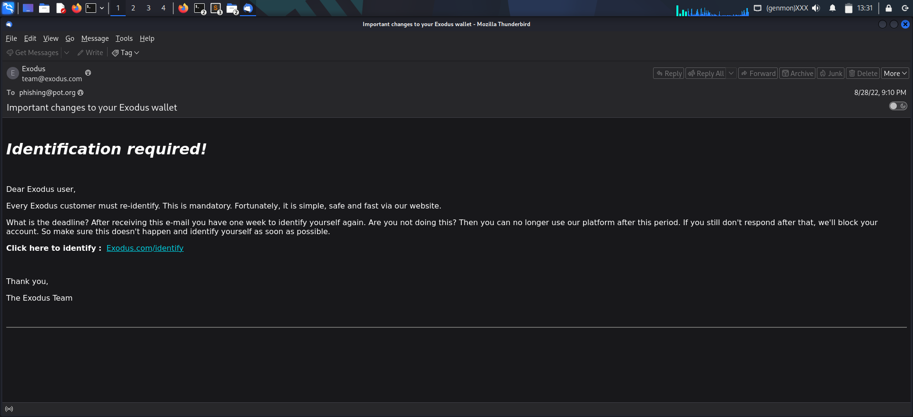

# Exodus Wallet Credential Phishing

| Field | Value |
|-------|-------|
| **Category** | Phishing Analysis |
| **Date** | 2026-03-31 |

---

## Executive Summary

**Verdict:** Phishing

Phishing email impersonating Exodus cryptocurrency wallet. Sender spoofed exodus.com but Message-ID and Return-Path reveal true origin (aishwaryainteriors.in). Contains masked URL redirecting through pxlme.me shortener to phishing server in France. DMARC failed, confirming spoofed sender.

---

## Analysis

### Step 1: Initial Triage

Received `sample-22.eml`. Opened in Thunderbird and Sublime Text for header analysis.



### Step 2: Header Analysis

```
From: Exodus <team@exodus[.]com>
Message-Id: <H65MKHQRQHU4.KDODSKQQ3JCD2@aishwaryainteriors[.]in>
Sender: admin@apps[.]aishwaryainteriors[.]in
Return-Path: admin@apps[.]aishwaryainteriors[.]in
X-Sender-IP: 192[.]185[.]51[.]139
X-Source-IP: 92[.]60[.]40[.]237
```

Email pretends to be from exodus.com but Message-ID indicates that email came from aishwaryainteriors.in

### Step 3: Authentication Results

```
spf=none    ← No SPF record for sending domain
dkim=pass   ← Signed by aishwaryainteriors.in (not exodus.com)
dmarc=fail  ← Domain alignment failed
```

SPF=none and DMARC=fail confirm the email is **spoofed**. The sender claims to be exodus.com but authentication proves otherwise.

### Step 4: Reputation

**VirusTotal:** Neither sender IP nor source IP are flagged as suspicious according to VirusTotal.

**whois.domaintools:** Indicates that the resolved host of sender IP is gateway24.websitewelcome.com, which is a host used by HostGator company email servers.

**SPF Check:**
```bash
$ dig TXT aishwaryainteriors.in +short | grep spf
"v=spf1 include:_spf.mail.hostinger.com ~all"
```

Domain allows only Hostinger servers, but email came from HostGator IP - another mismatch.

### Step 5: URL/Attachment Analysis

```html
<a href="https://pxlme.me/zAVvQVdl">Exodus.com/identify</a>
```

**Link Masquerading:** Displayed text shows "Exodus.com/identify" but actual URL is `pxlme.me` (URL shortener).

**URLScan.io Investigation:** Found URL targets IP 51.15.139.10 located in Paris, France. Belongs to AS12876 Scaleway SAS, FR, which is a French cloud computing and hosting provider based in Paris, part of the Iliad Group.

### Step 6: Findings

- 51.15.139.10 - 1/96 security vendors flagged this URL as malicious in VirusTotal
- Triple mismatch: From header (exodus.com) ≠ Return-Path (aishwaryainteriors.in) ≠ SPF allowed servers (Hostinger vs HostGator)
- URL shortener used to hide malicious destination
- Target: Cryptocurrency wallet users (high-value targets)

---

## Indicators of Compromise (IOCs)

| Type | Value | Description |
|------|-------|-------------|
| Email | `admin[@]apps[.]aishwaryainteriors[.]in` | Actual sender |
| Domain | `aishwaryainteriors[.]in` | Sender domain |
| URL | `hxxps[://]pxlme[.]me/zAVvQVdl` | Malicious redirect link |
| IP | `192[.]185[.]51[.]139` | Sender IP (HostGator) |
| IP | `51[.]15[.]139[.]10` | Phishing server (Scaleway, France) |
| Display Name | `Exodus` | Impersonated brand |

---

## MITRE ATT&CK Mapping

| Tactic | Technique | ID | Evidence |
|--------|-----------|-----|----------|
| Initial Access | Phishing: Spearphishing Link | T1566.002 | Email contains malicious URL |
| Execution | User Execution: Malicious Link | T1204.001 | Victim must click to trigger attack |
| Defense Evasion | Masquerading: Match Legitimate Name | T1036.005 | Link text "Exodus.com/identify" hides real URL |
| Reconnaissance | Phishing for Information: Spearphishing Link | T1598.003 | Likely harvesting crypto wallet credentials |

---

## Tools Used

- Thunderbird - Email viewing
- Sublime Text - Raw header analysis
- VirusTotal - IP/URL reputation check
- URLScan.io - URL investigation and redirect tracing
- whois.domaintools - IP ownership lookup
- dig - SPF record verification

---

## Lessons Learned

- **Check Message-ID domain** - It reveals the true sender even when From header is spoofed
- **SPF/DKIM pass doesn't mean legitimate** - DKIM passed but for wrong domain (aishwaryainteriors.in, not exodus.com)
- **URL shorteners hide malicious destinations** - pxlme.me masked the actual phishing page
- **Link text can lie** - Displayed "Exodus.com/identify" but actual URL was completely different
- **Crypto-related phishing is high value** - Attackers target wallet users because successful theft = direct money
- **Always verify SPF against Return-Path** - Not the From header
- **Check for triple mismatch** - From header, Return-Path, and actual sending server should align

---

## References

- [MITRE ATT&CK - Phishing](https://attack.mitre.org/techniques/T1566/)
- [MITRE ATT&CK - User Execution](https://attack.mitre.org/techniques/T1204/)
- [MITRE ATT&CK - Masquerading](https://attack.mitre.org/techniques/T1036/)
- [Exodus Wallet](https://www.exodus.com/) - Legitimate cryptocurrency wallet
